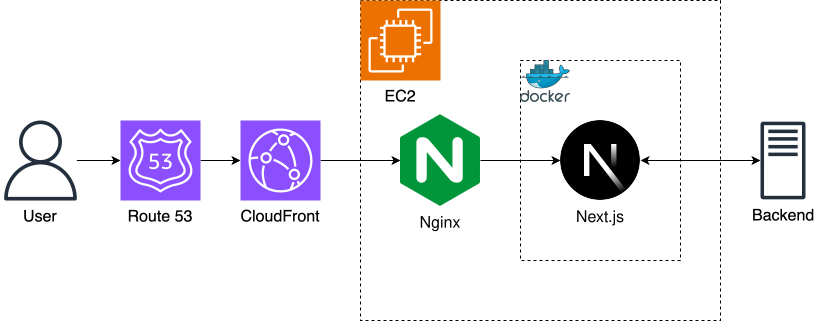

# Sayyo 앱 소개 및 게시글 공유용 웹페이지 (이전 버전)

## 개요

- 베트남의 지역 기반 재능 및 중고 거래 플랫폼 서비스인 Sayyo 어플리케이션의 소개 홈페이지입니다.
- 앱에서 외부로 게시글을 공유하고 싶을 때 사용하는 공유용 웹페이지가 포함되어 있습니다.
- 현재 상용 버전이 아닌 이전 버전입니다.
- <a href="https://sayyo-web-public.pages.dev/" target="_blank" rel="noopener">Web</a> - 상용 버전이 아니라 공유용 웹페이지는 접근이 불가합니다.

## 프로젝트 일정

- 2024.9 ~ 2026.4

## 내용

### 메인 페이지

### 공유용 웹 페이지

## 기술 스택

- Next.js
- Typescript
- Axios
- Tailwind CSS

## 인프라 구조

## CI/CD

